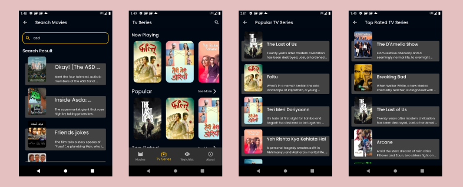
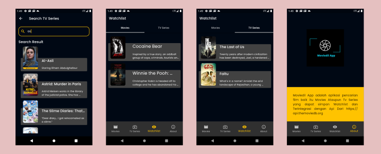
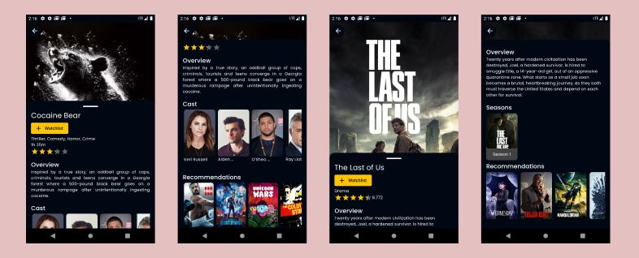

# Moviedil App (Flutter Movie App) //API Consumed

Moviedil App adalah aplikasi pencarian film baik itu Movies Ataupun Tv Series yang dapat simpan Watchlist Movies dan Tv Series Terintegrasi dengan Api Dari https://api.themoviedb.org, terdapat detail pemeran pada film,dan detail season pada tv series. Menggunakan State Management Bloc.

## Link Aplikasi
https://drive.google.com/file/d/1euWMK10CqgWwD8cJPXJBcVg-jiq5ljVP/view?usp=share_link

## Detail Aplikasi

## Dependencies
This app uses the following dependencies:

- cached_network_image: ^3.2.3
- cupertino_icons: ^1.0.2
- dartz: ^0.10.1
- equatable: ^2.0.5
- flutter_bloc: ^8.1.2
- flutter_rating_bar: ^4.0.1
- get_it: ^7.2.0
- google_fonts: ^4.0.3
- flutter_launcher_icons: ^0.12.0
- http: ^0.13.5
- rxdart: ^0.27.7
- sqflite: ^2.2.6

